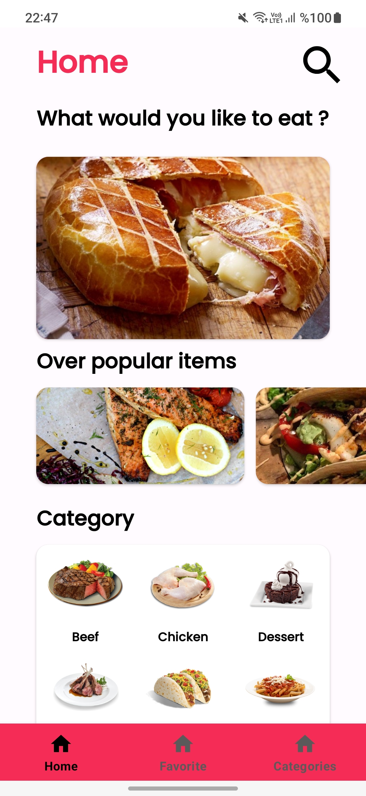
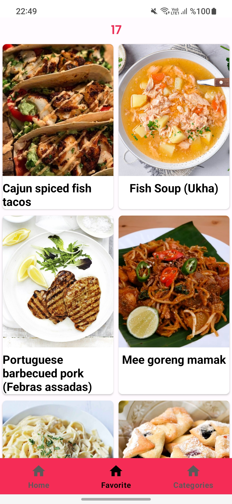
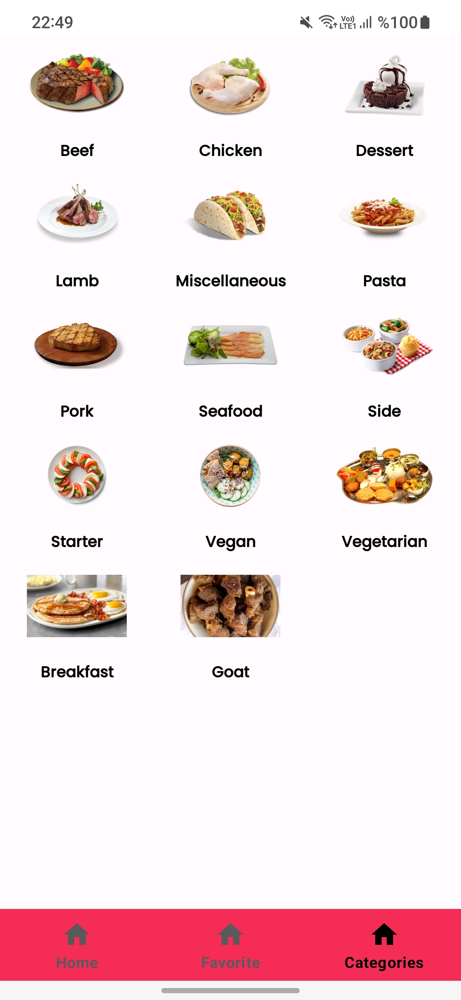
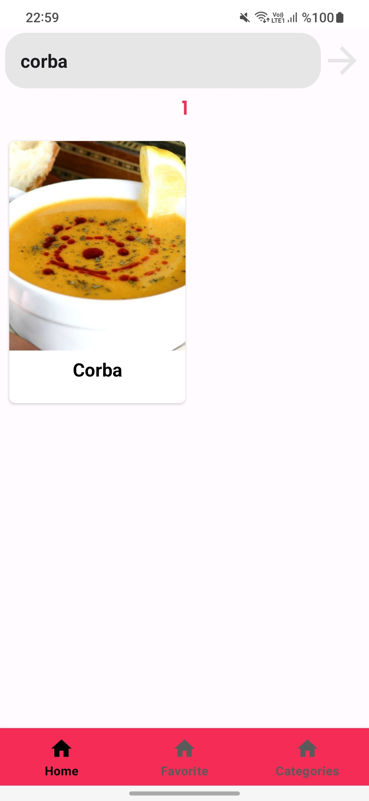
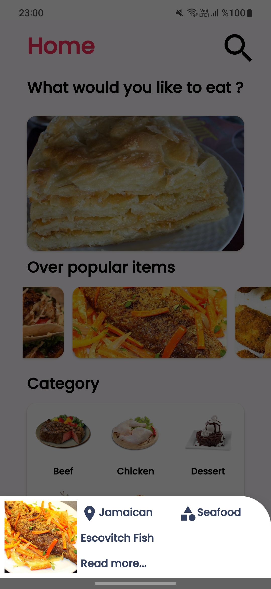
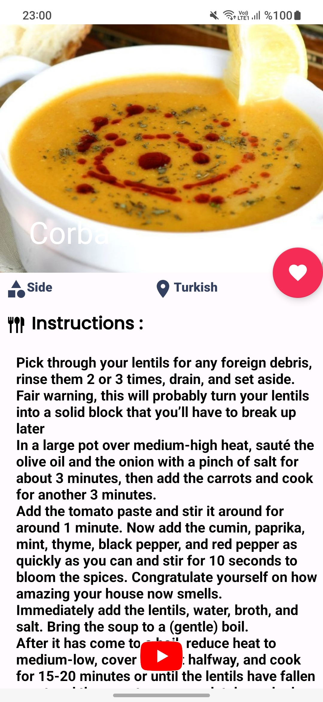

# MVVMFood
 MVVMFoodApp

Bu proje, MVVM (Model-View-ViewModel) mimarisi kullanılarak geliştirilmiş bir yemek uygulamasını içermektedir.

## Genel Bakış

Proje, yemek kategorilerini ve bu kategorilere ait yemekleri listeleme yeteneğine sahip bir mobil uygulamadır. Uygulama Retrofit ile dış API'lerden yemek verilerini çekip kullanıcıya mevcut yemeğin tarifini sağlamakta ve mevcut yemeğin youtube üzerinden yapılışına dair bir video sağlamaktadır.Ayrıca kullanıcı beğendiği yemekleri bir buton yardımı ile database içinde saklayıp istediği zaman kolayca ulaşabilmektedir.

## Özellikler

- Kullanıcı uygulamaya her girdiğinde rastgele bir yemek kullanıcıya sunulmaktadır.Kullanıcı isterse bu yemeğin detaylarına ; tarifine ve youtube üzerinden yapılış videosuna ulaşabilir.

- Kullanılan API üzerinden popüler yemekler kullanıcıya recyclerview içinde sunulmakta.Kullanıcı popüler bir yemeğe uzun tıklama gerçekleştirirse ekranın alt
kısmında bottom sheet fragment'da yemeğe dair ufak bir bilgilendirme fragmant'ı açılır ve oradan isterse yemeğin tüm detaylarına ulaşabilir veya popüler yemekler kısmında bulunan herhangi bir yemeğe tıklayarak , o yemeğe ait detaylara yine ulaşabilir.

- Kullanıcı arama butonu üzerinden API'de kayıtlı bulunan yemekleri isimlerine göre aratabilir ve yemeğin detaylarına ulaşabilir.

- Kullanıcıya yemekler kategorilerine göre ayrılmış bir şekilde de sunuluyor.Burada istenen kategori seçilerek kategoriye ait yemeklere ulaşabilir.Oradan da yine seçilecek herhangi bir yemeğin detaylarına ulaşılabilir.

- Detaylarına ulaşılan her yemek kaydetme butonu ile database(room)'e kaydedilebilir ve daha sonra bu yemeğe kolayca ulaşılabilir.

- Kaydedilen yemek daha sonra favorite fragments'da sağa veya sola kaydırılarak database'den silme işlemi gerçekleştirilebilir.
  
## Kullanılan Teknolojiler

- Kotlin

- Android Architecture Components (ViewModel, LiveData)

- ViewBinding

- NavigationComponent

- Retrofit

- Glide

- Database(room)

- Coroutines

- RecyclerView


- ## Ekran Görüntüleri









## Kurulum

Proje dosyalarını bilgisayarınıza klonlayın veya ZIP olarak indirin. Android Studio'da açın ve emülatör veya fiziksel bir cihaz üzerinde çalıştırın.

```bash
git clone https://github.com/hariellevardamir/MVVMFood.git

